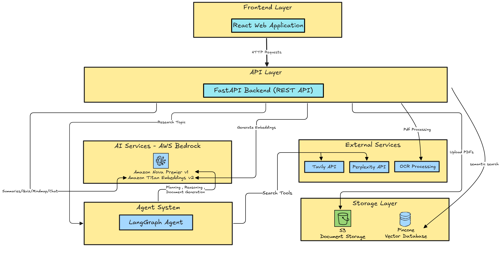

# Research Paper Analysis System

**AI-Powered Research Assistant with AWS Bedrock Integration**

A comprehensive full-stack application that leverages AWS Bedrock's advanced AI models to analyze research papers, enabling intelligent document processing, semantic search, conversational Q&A, and autonomous research capabilities.

----------

## Overview

The Research Paper Analysis System is an enterprise-grade platform designed to transform how researchers interact with academic papers. By combining AWS Bedrock's powerful AI models (Amazon Nova Pro and Titan Embeddings) with modern web technologies, the system provides an intuitive interface for uploading PDFs, extracting insights, generating summaries, creating quizzes, visualizing concepts, and conducting autonomous research.

### Key Capabilities

-   **Intelligent Document Processing**: Upload PDFs and extract structured content using OCR technology
-   **Semantic Search**: Query papers using natural language with RAG (Retrieval-Augmented Generation)
-   **AI-Powered Analysis**: Generate comprehensive summaries, quizzes, and mind maps
-   **Autonomous Research**: LangGraph-powered agent for web-based research with automated report generation
-   **Scalable Architecture**: Efficient processing for handling large documents
-   **Modern UI**: Responsive React interface with dark mode and smooth animations

----------

## AWS Bedrock Integration

The system is built on AWS Bedrock, Amazon's fully managed service for foundation models, providing enterprise-grade AI capabilities with security and scalability.

### Amazon Nova Pro v1

**Model ID**: `us.amazon.nova-pro-v1:0`

Amazon Nova Pro serves as the primary language model for all text generation and analysis tasks:

-   **Conversational AI**: Powers the RAG-based chat interface for natural Q&A with research papers
-   **Document Analysis**: Generates comprehensive 9-section summaries covering methodology, results, and implications
-   **Educational Content**: Creates contextual quiz questions with detailed explanations
-   **Knowledge Visualization**: Produces hierarchical mind maps in Markmap format
-   **Research Automation**: Drives the LangGraph agent for autonomous multi-step research workflows
-   **Structured Output**: Leverages Bedrock's structured output capabilities for consistent JSON responses

The model is accessed through LangChain's `ChatBedrockConverse` wrapper, enabling seamless integration with the broader LangChain ecosystem for prompt engineering, chain composition, and output parsing.

### Amazon Titan Embeddings v2

**Model ID**: `amazon.titan-embed-text-v2:0`

Titan Embeddings v2 provides high-quality vector representations for semantic search:

-   **Embedding Dimension**: 1024-dimensional vectors optimized for semantic similarity
-   **Text Chunking**: Converts document chunks into dense vector representations
-   **Semantic Retrieval**: Enables accurate context retrieval for RAG queries
-   **Consistent Encoding**: Ensures uniform vector generation across all documents
-   **Pinecone Integration**: Vectors stored in Pinecone for fast similarity search

The embedding service uses LangChain's `BedrockEmbeddings` wrapper, providing a standardized interface for vector generation and seamless integration with vector databases.

### AWS Configuration

**Region**: `us-east-1` (configurable)

The system requires AWS credentials with appropriate IAM permissions:

-   **Bedrock Permissions**: `InvokeModel`, `InvokeModelWithResponseStream`
-   **S3 Permissions**: `PutObject`, `GetObject`, `DeleteObject`, `ListBucket`, `CreateBucket`

Credentials are managed through environment variables, supporting both access keys and IAM roles for production deployments.

----------

## AWS S3 Storage Architecture

Amazon S3 serves as the primary storage layer for all document-related data, providing durability, scalability, and cost-effective storage.

### Bucket Structure

**Bucket Name**: `research-paper-analysis`

```
research-paper-analysis/
├── raw_pdfs/
│   └── {paper_id}/
│       └── {filename}.pdf
├── parsed_markdown/
│   └── {paper_id}/
│       └── paper.md
└── hash_index/
    └── {file_hash}.txt

```

### Storage Components

**Raw PDFs**: Original uploaded documents stored with unique paper IDs for traceability

**Parsed Markdown**: OCR-processed content in markdown format for efficient text processing

**Hash Index**: SHA256-based duplicate detection system preventing redundant processing

### S3 Features Utilized

-   **Presigned URLs**: Temporary secure URLs for OCR processing without exposing credentials
-   **Automatic Bucket Creation**: System automatically provisions S3 bucket if not present
-   **Content Type Management**: Proper MIME types for PDFs and markdown files
-   **Existence Checks**: Efficient file validation before operations

----------

## System Architecture

### High-Level Architecture Diagram



### Technology Stack

**Backend**:

-   FastAPI for high-performance REST API
-   LangChain for LLM orchestration and RAG pipelines
-   LangGraph for autonomous agent workflows
-   Boto3 for AWS SDK integration
-   Pinecone for vector database storage

**Frontend**:

-   React 18 with modern hooks architecture
-   Vite for lightning-fast development and builds
-   Tailwind CSS for utility-first styling
-   Framer Motion for smooth animations
-   Axios for HTTP client communication

**External Services**:

-   Mistral AI for OCR processing
-   Tavily and Perplexity for web search
-   Pinecone for vector similarity search

### Data Flow

**Document Processing Pipeline**:

```
PDF Upload → S3 Storage → Presigned URL → Mistral OCR → 
Markdown Extraction → S3 Storage → Hash Indexing → 
Text Chunking → Bedrock Embeddings → Pinecone Vector Storage

```

**RAG Query Pipeline**:

```
User Question → Bedrock Embeddings → Pinecone Similarity Search → 
Context Retrieval → Bedrock Nova Pro → Answer Generation → 
Source Citations

```

**Research Agent Pipeline**:

```
Research Query → Planning (Bedrock) → Web Search (Tavily/Perplexity) → 
Analysis (Bedrock) → Evidence Collection → Reasoning Loop → 
Document Generation (Bedrock) → Markdown Report

```

----------

## Core Features

### 1. PDF Upload & Processing

Upload research papers with intelligent duplicate detection:

-   **Drag-and-drop interface** with file validation (PDF only, max 5MB)
-   **SHA256 hash-based duplicate detection** to prevent reprocessing
-   **Mistral OCR integration** for accurate text extraction from PDFs
-   **Markdown conversion** for structured content representation
-   **Progress tracking** with real-time status updates
-   **Automatic embedding generation** for immediate search capability

### 2. Conversational AI Chat

RAG-powered Q&A system for natural language interaction with research papers:

-   **Context-aware responses** using retrieved document chunks
-   **Source citations** with expandable metadata for transparency
-   **Paper-specific queries** or cross-paper search capabilities
-   **Markdown rendering** with LaTeX math support for equations
-   **Suggested questions** to guide exploration
-   **Configurable retrieval** (top-k parameter for precision/recall balance)

### 3. Comprehensive Summaries

AI-generated structured analysis covering nine critical aspects:

-   Executive Summary
-   Background & Context
-   Research Problem
-   Methodology
-   Experiments & Setup
-   Results & Findings
-   Limitations
-   Implications
-   Future Work

Each section provides detailed academic prose with markdown formatting, tables, and LaTeX equations.

### 4. Interactive Quizzes

Educational assessment tool with AI-generated questions:

-   **10 multiple-choice questions** testing deep understanding
-   **Instant feedback** with correct/incorrect indicators
-   **Detailed explanations** for learning reinforcement
-   **Score tracking** with percentage calculation
-   **Retry capability** for repeated practice

### 5. Mind Map Visualization

Interactive hierarchical visualization of paper concepts:

-   **Markmap-based rendering** with zoom and pan controls
-   **Hierarchical structure** showing relationships between concepts
-   **LaTeX math support** in nodes for equations
-   **Expand/collapse functionality** for focused exploration
-   **New tab support** for full-screen viewing

### 6. Autonomous Research Agent

LangGraph-powered agent for comprehensive web research:

-   **Multi-step reasoning** with ReAct-style prompting
-   **Web search integration** using Tavily and Perplexity APIs
-   **Evidence collection** from multiple sources
-   **Iterative refinement** up to 15 research cycles
-   **Professional markdown reports** with citations
-   **Download capability** for offline access

----------

## Installation & Setup

### Prerequisites

-   Python 3.9+
-   Node.js 18+
-   AWS account with Bedrock access
-   Pinecone account
-   Mistral AI API key
-   Tavily API key
-   Perplexity API key

### Backend Setup

1.  Navigate to backend directory:

```bash
cd backend

```

2.  Install Python dependencies:

```bash
pip install -r requirements.txt

```

3.  Configure environment variables:

```bash
cp .env.example .env
# Edit .env with your credentials

```

4.  Start FastAPI server:

```bash
python main.py

```

The backend API will be available at `http://localhost:8000`

### Frontend Setup

1.  Navigate to frontend directory:

```bash
cd frontend

```

2.  Install Node dependencies:

```bash
npm install

```

3.  Start development server:

```bash
npm run dev

```

The frontend will be available at `http://localhost:3000`

### Environment Variables

Create a `.env` file in the `backend` directory with the following variables:

```env
# AWS Credentials
AWS_ACCESS_KEY_ID=your-aws-access-key
AWS_SECRET_ACCESS_KEY=your-aws-secret-key
AWS_DEFAULT_REGION=us-east-1

# API Keys
PINECONE_API_KEY=your-pinecone-api-key
MISTRAL_API_KEY=your-mistral-api-key
TAVILY_API_KEY=your-tavily-api-key
PERPLEXITY_API_KEY=your-perplexity-api-key

```

----------

## Usage

### Uploading a Paper

1.  Open the application in your browser
2.  Drag and drop a PDF file or click to browse
3.  Wait for OCR processing to complete
4.  Click "Generate Embeddings" to enable semantic search
5.  Monitor progress until completion

### Chatting with Papers

1.  Select the "Chat" tab
2.  Type your question in natural language
3.  View AI-generated answers with source citations
4.  Expand source documents to see original context
5.  Use suggested questions for guided exploration

### Generating Summaries

1.  Select the "Summary" tab
2.  Click "Generate Summary"
3.  Expand sections to read detailed analysis
4.  Use "Expand All" for full overview

### Taking Quizzes

1.  Select the "Quiz" tab
2.  Click "Generate Quiz"
3.  Answer multiple-choice questions
4.  Submit to view results and explanations
5.  Retry to practice again

### Viewing Mind Maps

1.  Select the "Mindmap" tab
2.  Click "Generate Mindmap"
3.  Interact with the visualization (zoom, pan, expand/collapse)
4.  Open in new tab for full-screen experience

### Conducting Research

1.  Select the "Research" tab
2.  Enter your research query
3.  Click "Start Research"
4.  Monitor progress as the agent searches and analyzes
5.  Download the generated report

----------

## API Documentation

The backend provides comprehensive REST API documentation:

-   **Swagger UI**: `http://localhost:8000/docs`
-   **ReDoc**: `http://localhost:8000/redoc`

### Key Endpoints

**Paper Management**:

-   `POST /api/papers/upload-and-process` - Upload and process PDF
-   `POST /api/papers/embed-store` - Generate embeddings
-   `GET /api/papers/{paper_id}/status` - Get paper status

**AI Analysis**:

-   `GET /api/papers/{paper_id}/summary` - Generate summary
-   `GET /api/papers/{paper_id}/quiz` - Generate quiz
-   `GET /api/papers/{paper_id}/mindmap` - Generate mind map

**Chat**:

-   `POST /api/chat/query` - RAG-based Q&A

**Research**:

-   `POST /api/research/query` - Autonomous research

----------

## Configuration

### AWS Bedrock Models

Models are configured in `backend/config/settings.py`:

```python
bedrock_chat_model = "us.amazon.nova-pro-v1:0"
bedrock_embedding_model = "amazon.titan-embed-text-v2:0"
embedding_dimension = 1024

```

### Text Chunking

Optimize chunk size for your use case:

```python
chunk_size = 1500  # characters per chunk
chunk_overlap = 200  # overlap between chunks

```

### Pinecone Configuration

```python
pinecone_index_name = "aws-pdf-index"

```

### S3 Configuration

```python
s3_bucket_name = "research-paper-analysis"
s3_raw_pdf_prefix = "raw_pdfs"
s3_parsed_markdown_prefix = "parsed_markdown"
s3_hash_index_prefix = "hash_index"

```

----------

## Performance & Scalability

### Efficient Processing

-   Duplicate detection prevents redundant OCR processing
-   Hash-based indexing for instant duplicate checks
-   Vector embeddings cached in Pinecone for fast retrieval
-   Optimized API endpoints for quick response times

## Project Structure

```
research-paper-analysis/
├── backend/
│   ├── agent/              # LangGraph research agent
│   ├── config/             # Configuration and settings
│   ├── controllers/        # Request handlers
│   ├── routes/             # API route definitions
│   ├── schemas/            # Pydantic models
│   ├── services/           # Business logic services
│   ├── tools/              # Agent tools
│   ├── utils/              # Utility functions
│   ├── main.py             # FastAPI application
│   └── requirements.txt    # Python dependencies
├── frontend/
│   ├── src/
│   │   ├── components/     # React components
│   │   ├── App.jsx         # Main application
│   │   └── main.jsx        # Entry point
│   ├── package.json        # Node dependencies
│   └── vite.config.js      # Vite configuration
└── README.md               # This file

```

----------

## Future Enhancements

### Planned Features

-   Multi-user authentication and authorization
-   Paper library with search and filtering
-   Collaborative annotations and highlights
-   Export summaries to PDF format
-   Multi-paper comparison analysis
-   Advanced search with filters
-   Bookmarking and favorites system
-   Sharing capabilities with access control

### Technical Improvements

-   CloudWatch integration for monitoring
-   Amazon Kendra for enterprise search
-   Bedrock AgentCore for advanced workflows
-   Automated testing suite
-   CI/CD pipeline with GitHub Actions

## Acknowledgments

-   **AWS Bedrock** for providing enterprise-grade AI models
-   **LangChain** for LLM orchestration framework
-   **LangGraph** for agent workflow capabilities
-   **Pinecone** for vector database infrastructure
-   **Mistral AI** for OCR processing
-   **Tavily & Perplexity** for web search APIs

**Built with AWS Bedrock, React, and FastAPI**

_Transforming research paper analysis with AI-powered insights_
